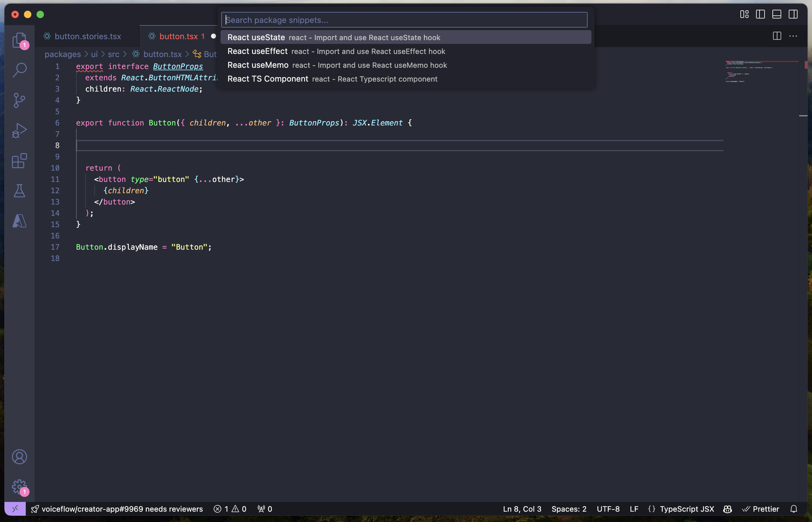

# Chunkflow

Speed up development with standard code snippets

## Features

This extesion automatically reads snippets from your package.json dependencies and you can use them similar to notion blocks. Typing `Cmd+/` will list them in the vscode quick picker

Describe specific features of your extension including screenshots of your extension in action. Image paths are relative to this README file.

For example if there is an image subfolder under your extension project workspace:

## Requirements

Your dependencies needs to have chunkflow snippets defined, or you can look for @chunkflow/your-dependency-name
